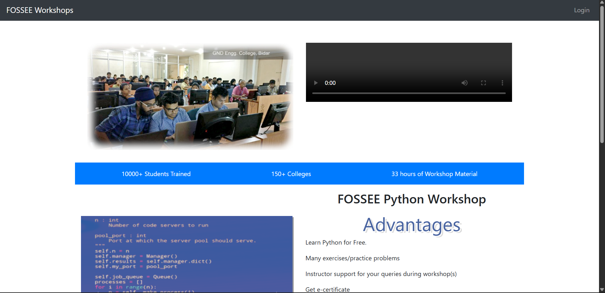
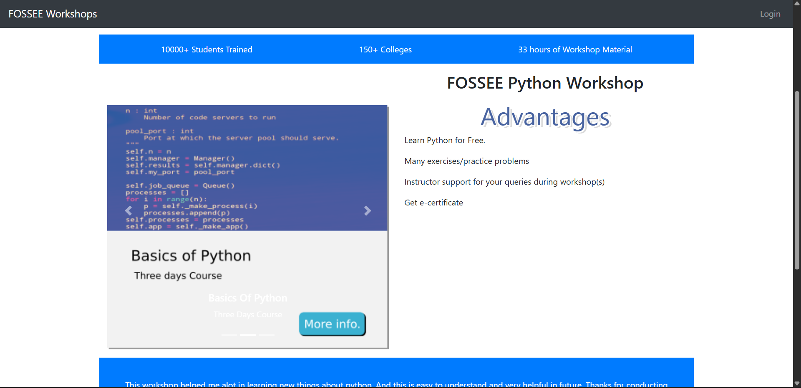
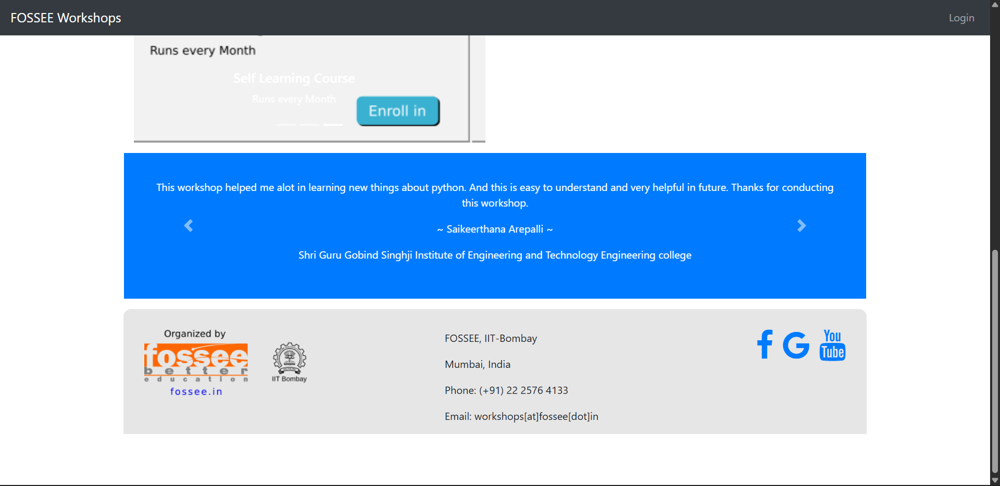
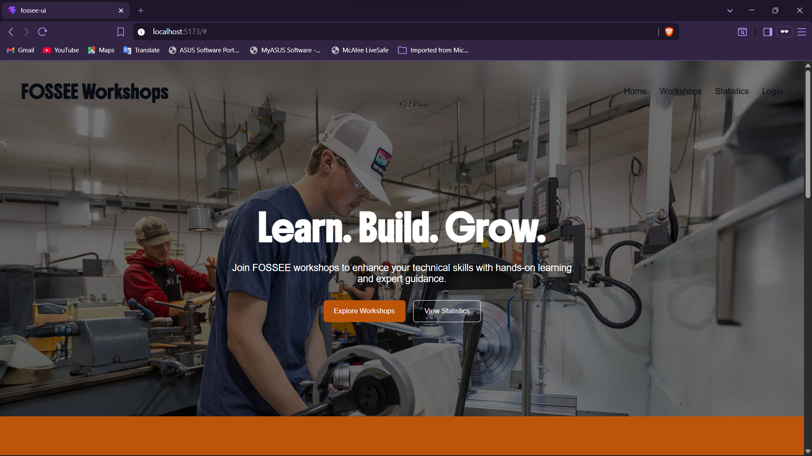
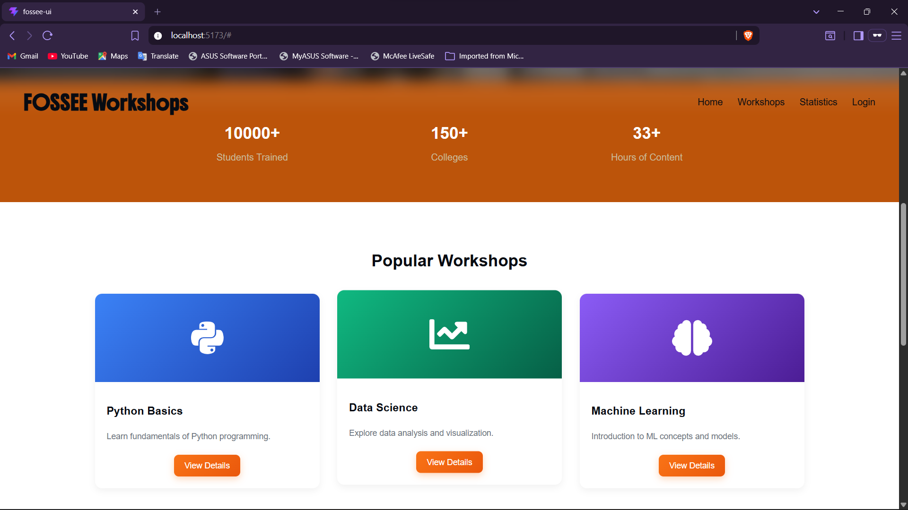
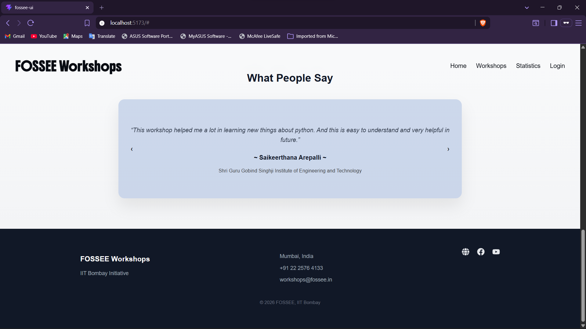
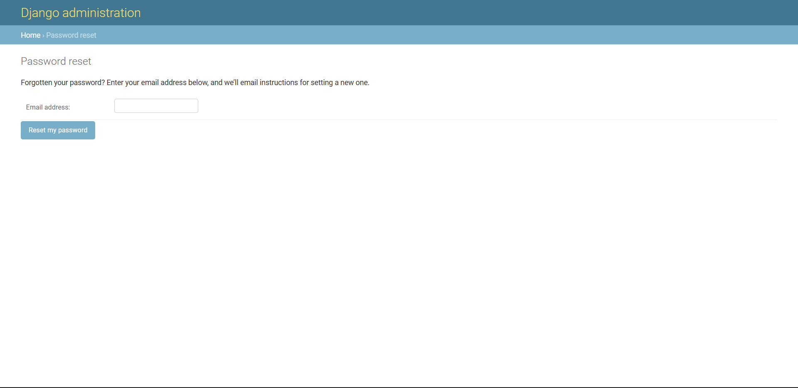
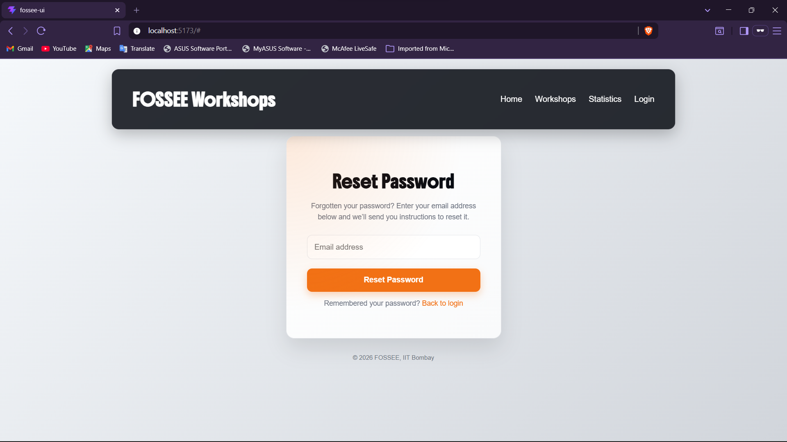
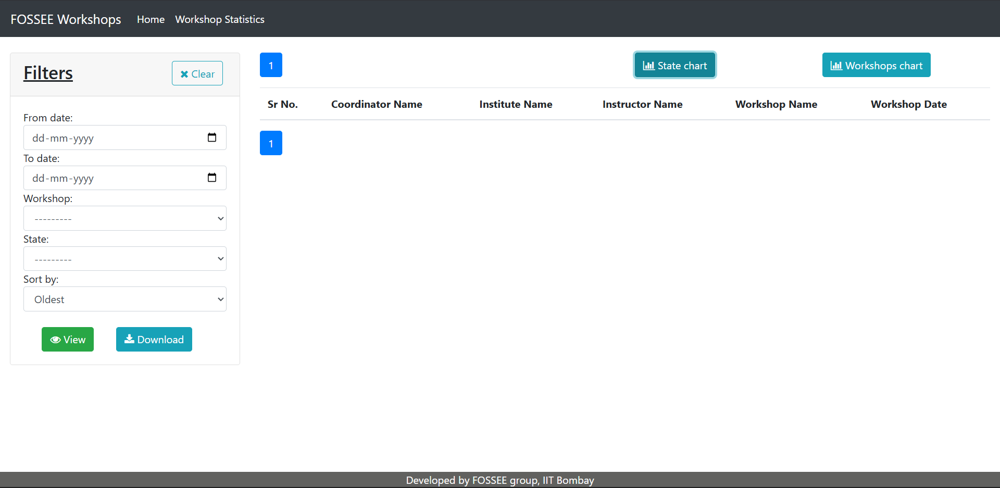
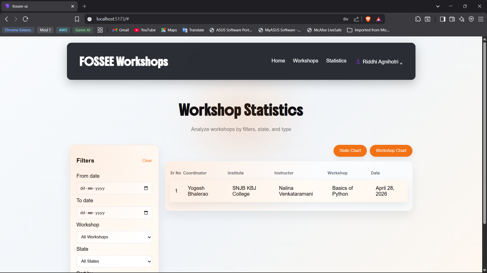

# FOSSEE Workshops Frontend Redesign

FOSSEE Fellowship Screening Task · Python · UI/UX Enhancement
A modern frontend redesign of the FOSSEE Workshop Booking platform with a focus on usability, performance, responsive design, accessibility and interaction driven UX.
The project not only focuses on visual styling but more importantly, identifies and resolves core UX, layout and interaction issues in the original interface.

## Table of Contents

- [Overview](#overview)
- [Key Issues Tackled](#key-issues-tackled)
- [Key Features](#key-features)
- [Reasoning](#reasoning)
  - [Design Principles](#1-what-design-principles-guided-your-improvements)
  - [Responsiveness](#2how-did-you-ensure-responsiveness-across-devices)
  - [Trade-offs](#3what-trade-offs-did-you-make-between-the-design-and-performance)
  - [Challenges](#4what-was-the-most-challenging-part-of-the-task-and-how-did-you-approach-it)
- [Screenshots and Demo Video](#screenshots-and-demo-video)
- [Setup](#setup)
- [Submission Checklist](#submission-checklist)
  
## Overview

The original platform suffered from inconsistent UI patterns, weak hierarchy and unclear user flows, leading to friction in navigation and interaction.

## Key issues tackled:

   - Lack of visual hierarchy
   - Responsiveness Issues
   - Poor Layout and Alignment
   - Weak Call To Actions (CTA)
   - Broken/Misleading Interactions
   - Dashboard Layout Imbalance
     
## Key Features:

   - Client side authentication state management
   - Dynamic navigation
   - Reusable navbar
   - Interactive dropdown menu
   - Expandable workshop details (replacing the workshop details page)
   - Responsive dashboard with charts and filters
     
## Reasoning

### 1. What design principles guided your improvements?
   
In this project, I focused on applying core design principles to imporve usability and clarity:
- **User-Centeric Design:** I focused usability over just aesthetics to ensure the interface feels intuitive.
- **Cognitive Load:** I reduced complicated interfaces by simplifying layouts, improving hierarchy and organizing information clearly.
- **Law of Proximity:** I grouped related elements to create clear relationships and improve readability.
- **Feedback Driven UI:** I made sure every interaction provides clear visual feedback such as hover states, cursor type, etc.
- **Dieter Rams' Principle of Simplicity:** I eliminated unnecessary visual and interaction elements to create a cleaner, more focused user experience.
- **Unified Design Language:** I maintained consistency aesthetically and practically throughout the pages to have a consistent user experience.

### 2.How did you ensure responsiveness across devices?

I made sure the app works properly across different screen sizes by handling responsiveness at both layout and component level.
- **Flexible layouts:**  I used Flexbox and percentage-based widths so components adjust naturally across screen sizes.
- **Fluid spacing and text:**  I used `clamp()` and relative units (`%`, `vw`, `rem`) so spacing and font sizes scale instead of breaking at smaller screens.
- **Controlled content width:**  I added `max-width` and centered layouts to avoid content stretching too much on large screens.
- **Handling overflow:**  Tables and wider elements were made scrollable using `overflow-x: auto` to prevent layout breakage on smaller devices.
- **Different navigation for mobile:**  I switched to a hamburger menu and dropdown for smaller screens instead of using the desktop layout.
- **Component adjustments:**  Cards, forms, and sections were made to stack vertically (`flexDirection: column`) on smaller screens.
- **Touch-friendly spacing:**  I increased padding and spacing so buttons and interactive elements are easier to use on mobile.
  
### 3.What trade-offs did you make between the design and performance?

During development, I made a few trade-offs to keep things simple and get things working smoothly:
- **Inline styling:**  I used inline styles since it made it easier to quickly tweak the UI while building. It worked well for this project, but isn’t the most scalable approach for larger apps.
- **State-based navigation:**  Instead of using React Router, I handled navigation using state (`setPage`). This kept things straightforward, but it does limit things like proper routing and deep linking.
- **Keeping animations minimal:**  I avoided adding too many animations to keep the interface fast and not distracting.
- **Frontend-only approach:**  I focused mainly on the UI/UX using mock data, so there’s no backend or data persistence yet.
- **Manual responsiveness:**  I handled responsiveness manually using Flexbox and CSS instead of a framework, which gave me more control but took more effort.

### 4.What was the most challenging part of the task and how did you approach it?

One of the main challenges was balancing how the UI looks with how easy it is to use.
- **Keeping things simple without making it boring:**  While improving the design, I had to avoid adding unnecessary elements that could make the interface harder to use.
- **Maintaining consistency across pages:**  Since multiple pages were involved, keeping spacing, layout, and interaction patterns consistent took some effort.
- **Making layouts work on smaller screens:**  Components like tables and forms didn’t translate well to mobile initially, so they had to be restructured to avoid breaking the layout.
- **Handling navigation without routing:**  Since I didn’t use React Router, managing page changes using state required careful handling to avoid rendering issues.
- **Fixing layout breakage issues:**  There were several cases where elements would overflow or misalign, especially on smaller screens, which required iterative fixes.

## Screenshots and Demo Video

### A few comparisons of old and new UI:

### Homepage before

### Homepage after

### Login Page before

### Login Page after

### Forgot Password Page before

### Forgot Password Page after

### Workshop Statistics Page before

### Workshop Statistics Page after

## Setup
### Requirements
   - Node.js (v16 or higher)
   - npm
### 1.Clone the repository
   - git clone https://github.com/Rid-agni/fossee-ui-redesign
   - cd src
### Install dependencies
   - npm install
### Run the app
   - npm run dev
   - open using the local host link
### Recommended (Run Production Build)
   - npm run build
   - npm run preview

## Submission Checklist:
- [x] Code is readable and well-structured  
- [x] Git history shows progressive work (no single commit dumps)  
- [x] README includes reasoning answers and setup instructions  
- [x] Screenshots or live demo link included  
- [x] Code is documented where necessary  
